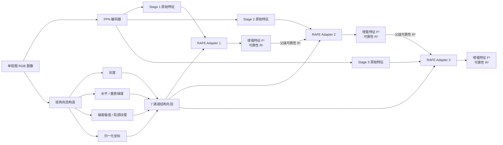
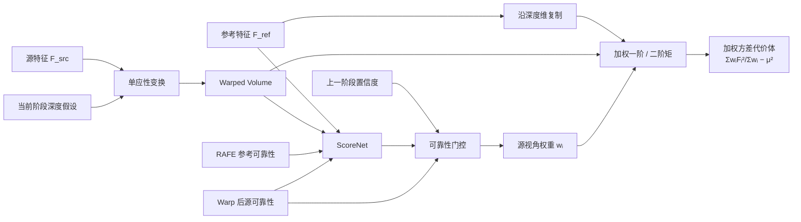
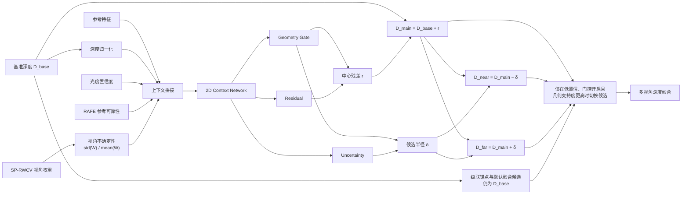

# R2-MVSNet 三模块网络结构图

当前完整模型：

`R2-MVSNet Full = RAFE + SP-RWCV + Anchor-FGDR candidate fusion`

## 1. 总体网络

```mermaid
flowchart LR
    I["多视图图像<br/>参考图 + N-1 张源图"] --> F

    subgraph F["共享多尺度特征提取"]
        direction TB
        B["FPN FeatureNet"] --> R["RAFE<br/>可靠性感知特征增强"]
        P["灰度 / 梯度 / 纹理 / 坐标<br/>结构先验"] --> R
        R --> O["三尺度特征 Fᵢˢ<br/>三尺度可靠性 Rᵢˢ"]
    end

    O --> S1

    subgraph S1["Stage 1：1/4 分辨率，48 个深度假设"]
        direction LR
        W1["单应性变换<br/>源特征 + 源可靠性"] --> A1["SP-RWCV<br/>源视角可靠性加权"]
        A1 --> V1["加权方差代价体"]
        V1 --> C1["3D CostRegNet"]
        C1 --> D1["Softmax + 深度回归<br/>D₁ / P₁ / W₁"]
        D1 --> G1["Anchor-FGDR<br/>候选深度几何"]
    end

    S1 -->|"基准深度 D₁<br/>上采样并缩小搜索区间"| S2

    subgraph S2["Stage 2：1/2 分辨率，32 个深度假设"]
        direction LR
        W2["单应性变换"] --> A2["SP-RWCV"]
        A2 --> V2["加权方差代价体"]
        V2 --> C2["3D CostRegNet"]
        C2 --> D2["Softmax + 深度回归<br/>D₂ / P₂ / W₂"]
        D2 --> G2["Anchor-FGDR"]
    end

    S2 -->|"基准深度 D₂<br/>上采样并缩小搜索区间"| S3

    subgraph S3["Stage 3：全分辨率，8 个深度假设"]
        direction LR
        W3["单应性变换"] --> A3["SP-RWCV"]
        A3 --> V3["加权方差代价体"]
        V3 --> C3["3D CostRegNet"]
        C3 --> D3["Softmax + 深度回归<br/>D₃ / P₃ / W₃"]
        D3 --> G3["Anchor-FGDR"]
    end

    G3 --> K["D_base / D_main / D_near / D_far<br/>geometry gate"]
    K --> Q["多视角几何支持度比较<br/>保守候选切换"]
    Q --> U["深度图融合"]
    U --> PC["稠密点云"]

    classDef rafe fill:#E8F3FF,stroke:#2F74C0,stroke-width:2px;
    classDef spr fill:#FFF1DB,stroke:#D9822B,stroke-width:2px;
    classDef fgdr fill:#EDE7FF,stroke:#7656C9,stroke-width:2px;
    class R rafe;
    class A1,A2,A3 spr;
    class G1,G2,G3 fgdr;
```



图中 `Pₛ` 表示光度置信度，`Wₛ` 表示源视角权重。Anchor 结构下，级联采样中心始终使用原始基准深度 `Dₛ`，FGDR 候选不覆盖主路径。

## 2. RAFE：可靠性感知特征增强



RAFE 的核心残差形式：

`F' = F + α · gate · reliability_gate · prior_feature`

## 3. SP-RWCV：单次可靠性加权代价体



ScoreNet 使用参考特征、Warp 特征均值、绝对差、最大相关性、有效掩码，以及启用 RAFE 时的参考/源可靠性。权重围绕 `1` 做受限残差调整，保持基线方差聚合稳定。

## 4. Anchor-FGDR：面向融合的深度候选生成



## 5. 三个模块的职责边界

| 模块 | 插入位置 | 主要判断 | 主要输出 |
|---|---|---|---|
| RAFE | FPN 各尺度输出之后 | 哪些像素/区域可靠 | 增强特征、像素可靠性 |
| SP-RWCV | Homography warp 后、CostRegNet 前 | 哪些源视角可靠 | 视角权重、加权方差代价体 |
| Anchor-FGDR | 深度回归之后 | 哪些位置需要候选几何以利于融合 | main/near/far 候选、几何门控 |

---

# 附录 A：FeatureNet + RAFE 完整卷积层清单（Visio 画图参考）

## A.0 图例 / 元件约定

| 元件 | Visio 表示 | 说明 |
|---|---|---|
| `Conv2d` | 圆角矩形，蓝色填充 | Conv2d + BatchNorm2d + ReLU（项目自定义类） |
| `nn.Conv2d` | 圆角矩形，灰色填充 | 纯 2D 卷积，无 BN，无激活 |
| 特征图 Tensor | 直角矩形，白色/无色 | 标注 `[B, C, H, W]` |
| 加法 ⊕ | 圆形，橙色 | element-wise add |
| 上采样 ↑2 | 梯形，绿色 | F.interpolate, scale=2, nearest |
| 下采样 /2 | 梯形，红色 | stride=2 conv |
| Sigmoid σ | 六边形，黄色 | torch.sigmoid |
| Concat | 括号 "[" 形 | channel 维拼接 |
| Bilinear Resize | 圆角矩形，浅绿 | F.interpolate, bilinear |

---

## A.1 编码器 Encoder（左列 → 纵向）

```
         Input [B, 3, H, W]
              │
┌─────────────────────────────────┐
│  conv0.0                        │
│  Conv2d 3→8, k=3, s=1, pad=1   │  [蓝] Conv+BN+ReLU
└─────────────────────────────────┘
              │
┌─────────────────────────────────┐
│  conv0.1                        │
│  Conv2d 8→8, k=3, s=1, pad=1   │  [蓝] Conv+BN+ReLU
└─────────────────────────────────┘
              │
         [8, H, W]  ────────► 送给 inner2 (FPN skip)
              │
┌─────────────────────────────────┐
│  conv1.0                        │
│  Conv2d 8→16, k=5, s=2, pad=2  │  [蓝] ★ 下采样 stride=2
└─────────────────────────────────┘
              │
         [16, H/2, W/2]
              │
┌─────────────────────────────────┐
│  conv1.1                        │
│  Conv2d 16→16, k=3, s=1, pad=1 │  [蓝]
└─────────────────────────────────┘
              │
┌─────────────────────────────────┐
│  conv1.2                        │
│  Conv2d 16→16, k=3, s=1, pad=1 │  [蓝]
└─────────────────────────────────┘
              │
         [16, H/2, W/2] ────────► 送给 inner1 (FPN skip)
              │
┌─────────────────────────────────┐
│  conv2.0                        │
│  Conv2d 16→32, k=5, s=2, pad=2 │  [蓝] ★ 下采样 stride=2
└─────────────────────────────────┘
              │
         [32, H/4, W/4]
              │
┌─────────────────────────────────┐
│  conv2.1                        │
│  Conv2d 32→32, k=3, s=1, pad=1 │  [蓝]
└─────────────────────────────────┘
              │
┌─────────────────────────────────┐
│  conv2.2                        │
│  Conv2d 32→32, k=3, s=1, pad=1 │  [蓝]
└─────────────────────────────────┘
              │
         [32, H/4, W/4] ────────► 进入 FPN decoder
```

**Encoder 总汇**

| Block | 子层 | 类型 | In→Out | Kernel | Stride | Pad |
|---|---|---|---|---|---|---|
| conv0 | [0] | Conv2d | 3→8 | 3 | 1 | 1 |
|  | [1] | Conv2d | 8→8 | 3 | 1 | 1 |
| conv1 | [0] | Conv2d | 8→16 | 5 | **2** | 2 |
|  | [1] | Conv2d | 16→16 | 3 | 1 | 1 |
|  | [2] | Conv2d | 16→16 | 3 | 1 | 1 |
| conv2 | [0] | Conv2d | 16→32 | 5 | **2** | 2 |
|  | [1] | Conv2d | 32→32 | 3 | 1 | 1 |
|  | [2] | Conv2d | 32→32 | 3 | 1 | 1 |

---

## A.2 FPN 输出头 Decoder Heads（中间列）

### Stage1（H/4 尺度）—— 无上采样，直接输出

```
[32, H/4, W/4]  ← 来自 conv2
      │
┌──────────────────────────┐
│  out1                    │
│  nn.Conv2d 32→32        │  [灰] 纯卷积, k=1, bias=False
└──────────────────────────┘
      │
 [32, H/4, W/4] ────────► 送入 RAFE_stage1 ──► stage1 输出
      │
      ├──── 同时继续向下传递（作为 FPN 的上采样源 intra_feat）
      │
      ▼
   [↑2] nearest ──► [32, H/2, W/2] ──► ⊕
```

### Stage2（H/2 尺度）

```
[16, H/2, W/2]  ← 来自 conv1
      │
┌──────────────────────────┐
│  inner1                  │
│  nn.Conv2d 16→32        │  [灰] 纯卷积, k=1, bias=True
└──────────────────────────┘
      │
 [32, H/2, W/2]
      │
      ├────────── ⊕ ─────── [32, H/2, W/2]  ← 与 ↑2(conv2_out) 相加
      │              │
      │     ┌──────────────────────────┐
      │     │  out2                    │
      │     │  nn.Conv2d 32→16        │  [灰] 纯卷积, k=3, pad=1, bias=False
      │     └──────────────────────────┘
      │              │
      │         [16, H/2, W/2] ────► 送入 RAFE_stage2 ──► stage2 输出
      │              │
      │              ├──── 继续向下传递（FPN 上采样源）
      │              │
      │              ▼
      │           [↑2] nearest ──► [16, H, W] ──► 注意：inner2 输出是 [32,H,W]，此处需 inner2 先做通道匹配
      │
```

### Stage3（H 尺度）

```
[8, H, W]  ← 来自 conv0
      │
┌──────────────────────────┐
│  inner2                  │
│  nn.Conv2d 8→32         │  [灰] 纯卷积, k=1, bias=True
└──────────────────────────┘
      │
 [32, H, W]
      │
      ├────────── ⊕ ─────── [32, H, W]  ← 与 ↑2(stage2_intra_feat) 相加
      │              │
      │     ┌──────────────────────────┐
      │     │  out3                    │
      │     │  nn.Conv2d 32→8         │  [灰] 纯卷积, k=3, pad=1, bias=False
      │     └──────────────────────────┘
      │              │
      │         [8, H, W] ────► 送入 RAFE_stage3 ──► stage3 输出
      │
```

**FPN Decoder 总汇**

| 层 | 类型 | In→Out | Kernel | Stride | Pad | Bias |
|---|---|---|---|---|---|---|
| out1 | nn.Conv2d | 32→32 | 1 | 1 | 0 | False |
| inner1 | nn.Conv2d | 16→32 | 1 | 1 | 0 | True |
| out2 | nn.Conv2d | 32→16 | 3 | 1 | 1 | False |
| inner2 | nn.Conv2d | 8→32 | 1 | 1 | 0 | True |
| out3 | nn.Conv2d | 32→8 | 3 | 1 | 1 | False |

---

## A.3 RAFE 模块内部结构（右侧，每 stage 一个）

### 通用结构（三个 stage 仅通道数不同）

```
feature [B, C, H_s, W_s]              structure_prior [B, 7, H, W]
      │                                         │
      │                               ┌─────────────────────────┐
      │                               │ bilinear resize         │  [浅绿]
      │                               │ → [7, H_s, W_s]        │
      │                               └─────────────────────────┘
      │                                         │
      │                               ┌─────────────────────────┐
      │                               │ prior_proj[0]           │
      │                               │ Conv2d 7→hidden        │  [蓝]
      │                               │ k=3, s=1, p=1          │
      │                               └─────────────────────────┘
      │                                         │
      │                               ┌─────────────────────────┐
      │                               │ prior_proj[1]           │
      │                               │ nn.Conv2d hidden→C     │  [灰]
      │                               │ k=1, bias=False         │
      │                               └─────────────────────────┘
      │                                         │
      │                            prior_feature [B, C, H_s, W_s]
      │                                         │
      ├──────────────── CONCAT ─────────────────┤
      │              [B, 2C, H_s, W_s]          │
      │                                         │
      │          ┌──────────────┬───────────────┘
      │          │              │
      │          ▼              ▼
      │  ┌──────────────┐ ┌──────────────┐
      │  │rel_head[0]   │ │ gate[0]      │
      │  │Conv2d 2C→hid │ │ Conv2d 2C→hid│  [蓝] [蓝]
      │  │k=3,s=1,p=1   │ │ k=3,s=1,p=1  │
      │  └──────────────┘ └──────────────┘
      │          │              │
      │  ┌──────────────┐ ┌──────────────┐
      │  │rel_head[1]   │ │ gate[1]      │
      │  │nn.Conv2d h→1 │ │ nn.Conv2d h→C│  [灰] [灰]
      │  │k=1,bias=0    │ │ k=1,bias=-2  │
      │  └──────────────┘ └──────────────┘
      │          │              │
      │          ▼              ▼
      │     [B, 1, H_s, W_s]  [B, C, H_s, W_s]
      │          │              │
      │     ┌────▼────┐         │
      │     │ Sigmoid │         │
      │     └────┬────┘         │
      │          │              │
      │    reliability_raw     gate_raw
      │          │              │
      │     ┌────▼──────────────────────────┐
      │     │ 若 parent_reliability 存在:   │
      │     │   reliability = 0.7×raw       │
      │     │              + 0.3×↑2(parent) │
      │     │ 否则:                          │
      │     │   reliability = raw           │
      │     └────┬──────────────────────────┘
      │          │              │
      │          ▼              ▼
      │     reliability    gate = σ(gate_raw)
      │          │              │
      │          ├──────┬───────┘
      │          │      │
      │          ▼      ▼
      │   reliability_gate = (0.5 + reliability).clamp(0.5, 1.5)
      │          │
      │          ▼
      │   ┌──────────────────────────────────┐
      │   │ residual_scale = σ(learned_logit)│  (初始值 logit=-2.2, 约 0.1)
      │   └──────────────┬───────────────────┘
      │                  │
      │    ┌─────────────┼─────────────┐
      │    │             │             │
      │    ▼             ▼             ▼
      │  enhanced = feature + scale × gate × reliability_gate × prior_feature
      │
      ▼
   输出: enhanced_feature [B, C, H_s, W_s]
         reliability [B, 1, H_s, W_s]
```

### 各 Stage 参数速查

| 参数 | Stage1 | Stage2 | Stage3 |
|---|---|---|---|
| 特征通道 C | 32 | 16 | 8 |
| hidden (max(8, C//2)) | 16 | 8 | 8 |
| **prior_proj[0]** Conv2d | 7→16, k3 | 7→8, k3 | 7→8, k3 |
| **prior_proj[1]** nn.Conv2d | 16→32, k1 | 8→16, k1 | 8→8, k1 |
| **gate[0]** Conv2d | 64→16, k3 | 32→8, k3 | 16→8, k3 |
| **gate[1]** nn.Conv2d | 16→32, k1 | 8→16, k1 | 8→8, k1 |
| **rel_head[0]** Conv2d | 64→16, k3 | 32→8, k3 | 16→8, k3 |
| **rel_head[1]** nn.Conv2d | 16→1, k1 | 8→1, k1 | 8→1, k1 |
| 父级 reliability | 无 | ↑2(R1), 0.3 | ↑2(R2), 0.3 |
| learned_logit 初值 | -2.2 | -2.2 | -2.2 |

---

## A.4 结构先验 Structure Prior（7 通道，无学习参数）

| 通道 | 名称 | 公式 |
|---|---|---|
| 0 | Gray | 0.299R + 0.587G + 0.114B |
| 1 | Grad X | gray[:,:,1:] - gray[:,:,:-1] + pad |
| 2 | Grad Y | gray[:,1:,:] - gray[:,:-1,:] + pad |
| 3 | Grad Mag | sqrt(grad_x² + grad_y² + 1e-6) |
| 4 | Texture | AvgPool5((gray - AvgPool5(gray))²) |
| 5 | X coord | linspace(-1, 1, W), broadcast to [B,1,H,W] |
| 6 | Y coord | linspace(-1, 1, H), broadcast to [B,1,H,W] |

> 每通道独立做 (x - mean) / std 归一化，std clamp min=1e-4

---

## A.5 顶层全貌图（Visio 建议布局）

```
┌──────────────────────────────────────────────────────────────────────┐
│                         FeatureNet + RAFE 总图                        │
│                                                                       │
│   [左] Encoder          [中] FPN Decoder        [右] RAFE ×3         │
│                                                                       │
│   RGB [3,H,W] ──────────────────────────────────► structure_prior     │
│      │                                              [7,H,W]           │
│      ▼                                                 │              │
│   ┌──────┐                                            │              │
│   │conv0 │──► [8,H,W] ────────────────┐               │              │
│   └──────┘                             │               │              │
│      │                                 │               │              │
│   ┌──────┐                             │               │              │
│   │conv1 │──► [16,H/2,W/2] ──────┐    │               │              │
│   └──────┘                        │    │               │              │
│      │                            │    │               │              │
│   ┌──────┐                        │    │               │              │
│   │conv2 │──► [32,H/4,W/4]       │    │               │              │
│   └──────┘        │               │    │               │              │
│                   │               │    │               │              │
│              ┌────▼────┐          │    │               │              │
│              │  out1   │          │    │               │              │
│              │ k1,32→32│          │    │               │              │
│              └────┬────┘          │    │               │              │
│                   │               │    │               │              │
│              ┌────▼────────────────────▼──┐            │              │
│              │        RAFE_s1             │◄───────────┤ prior(H/4)   │
│              │       C=32, h=16           │            │              │
│              └────────────┬───────────────┘            │              │
│                   │ stage1 [32,H/4]                    │              │
│                   │                                    │              │
│              ┌────▼────┐                               │              │
│              │   ↑2    │  nearest                      │              │
│              └────┬────┘                               │              │
│                   │ [32,H/2]                           │              │
│                   │         ┌──────┐                   │              │
│                   ├────⊕───┤inner1 │                   │              │
│                   │         │k1,16→32                   │              │
│                   │         └──────┘                   │              │
│                   │              ↑                      │              │
│                   │        [16,H/2,W/2] ← conv1        │              │
│              ┌────▼────┐                               │              │
│              │  out2   │                               │              │
│              │ k3,32→16│                               │              │
│              └────┬────┘                               │              │
│                   │                                    │              │
│              ┌────▼───────────────────────────────────┤              │
│              │        RAFE_s2             │◄───────────┤ prior(H/2)   │
│              │       C=16, h=8            │            │              │
│              │   ↑ parent_rel from s1     │            │              │
│              └────────────┬───────────────┘            │              │
│                   │ stage2 [16,H/2]                    │              │
│                   │                                    │              │
│              ┌────▼────┐                               │              │
│              │   ↑2    │  nearest                      │              │
│              └────┬────┘                               │              │
│                   │ [16,H]                             │              │
│                   │         ┌──────┐                   │              │
│                   ├────⊕───┤inner2 │                   │              │
│                   │         │k1,8→32│                   │              │
│                   │         └──────┘                   │              │
│                   │              ↑                      │              │
│                   │        [8,H,W] ← conv0              │              │
│              ┌────▼────┐                               │              │
│              │  out3   │                               │              │
│              │ k3,32→8 │                               │              │
│              └────┬────┘                               │              │
│                   │                                    │              │
│              ┌────▼───────────────────────────────────┤              │
│              │        RAFE_s3             │◄───────────┤ prior(H)     │
│              │       C=8, h=8             │            │              │
│              │   ↑ parent_rel from s2     │            │              │
│              └────────────┬───────────────┘            │              │
│                   │ stage3 [8,H]                       │              │
│                                                         │              │
│   输出: {"stage1": [32,H/4], "stage2": [16,H/2], "stage3": [8,H],    │
│          "stage1_reliability": [1,H/4], ...}                         │
└──────────────────────────────────────────────────────────────────────┘
```

---

## A.6 画图顺序建议

| 步骤 | 内容 |
|---|---|
| 1 | 从 Encoder 开始画，三个 block 纵向排列，每个 block 内部展开子层 |
| 2 | 向右引出 FPN 分支，先画 top-down 路径（↑2 + ⊕ + inner） |
| 3 | out1/out2/out3 各接一个 RAFE 方框 |
| 4 | 画 structure_prior 横向穿过，连入每个 RAFE |
| 5 | 画 parent_reliability 的纵向连接（s1→s2→s3） |

- 蓝色圆角 = `Conv2d`（Conv+BN+ReLU）
- 灰色圆角 = `nn.Conv2d`（纯卷积）
- 橙色圆 = ⊕（加法）
- 绿色梯形 = ↑2（上采样）
- 浅绿方框 = bilinear resize
- 黄色六边形 = Sigmoid
